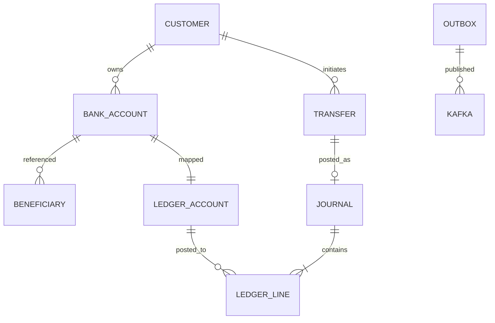

# Data model

## Identity (`identity`)

- `AspNetUsers` / `AspNetRoles` — ASP.NET Identity
- `customers` — profile + status

## Accounts (`accounts`)

- `bank_accounts` — customer-facing account, `xmin` token, unique simulated account number
- `beneficiaries` — unique per owner + sort code + number

## Payments (`payments`)

- `transfers` — state machine, unique `(sender, idempotency_key)`
- `idempotency_records` — persisted replay body

## Ledger (`ledger`)

- `ledger_accounts` — chart of accounts, unique `code`
- `journals` — unique `reference` and `idempotency_key`
- `ledger_lines` — check `amount > 0`, no updates after post

## Shared

- `outbox_messages`, `inbox_messages`
- `audit.audit_records`

Indexes exist on status, posted_at, customer_id, and processed_at as configured in each `OnModelCreating`.
